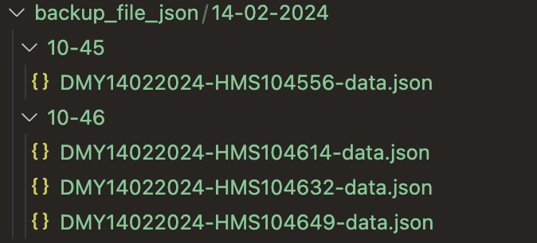
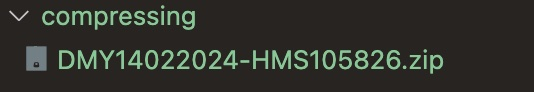
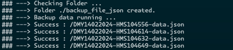

# backupAPI-nodejs
- เป็นระบบ backup API จาก Link url 
- ระบบสามารถ backup API ได้ตามช่วงเวลาที่กำหนด เช่น 1 ชม. 
- เมื่อครบวันเวลาที่กำหนด ระบบจะ compressing เป็น .zip ให้อัตโนมัติ เช่น ทุกๆวันที่ 28 ของทุกเดือน
- แสดงผล output ทาง Terminal

## Tech Stack in Project 

- **Language**
    - javascript(nodejs) 
- **Libraries** 
    - compressing 
    - fs 
    - node-fetchs


## Get Started
1. install project with npm

```bash
  cd backupAPI-nodejs
  npm install 
  node server.js
```
## Screenshots

Backup link api



Compressing file



Output terminal



## Used By
[](https://github.com/TopThiraphat)

## Support Me
[](https://ko-fi.com/R5R0RDJVK)


