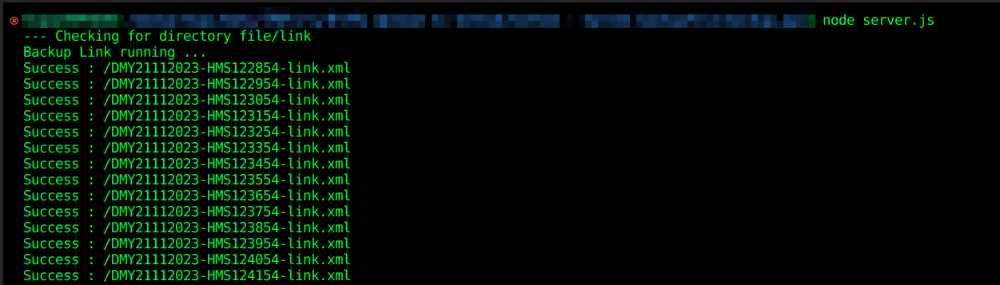
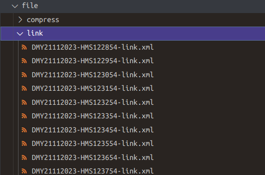

# backupAPI-nodejs
- เป็นระบบ backup API จาก Link url โดยแปลงไฟล์ให้เป็น XML
- ระบบจะ backup API ทุกๆ 1 นาที 
- เมื่อครบวันเวลาที่กำหนด ระบบจะ compress เป็น .zip ให้อัตโนมัติ 
- แสดงผล output ทาง Terminal

## Tech Stack in Project 

- **Language**
    - NodeJS
- **libraries** 
    - compressing 
    - fs 
    - node-fetch


## Get Started

Install project with npm

```bash
  cd backupAPI-nodejs
  npm install 
  node server.js
```
## Screenshots




## Used By
[](https://github.com/TopThiraphat)

## Support Me
[](https://ko-fi.com/R5R0RDJVK)


